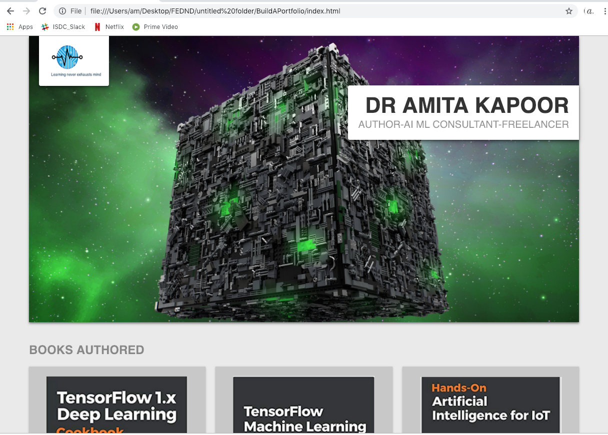
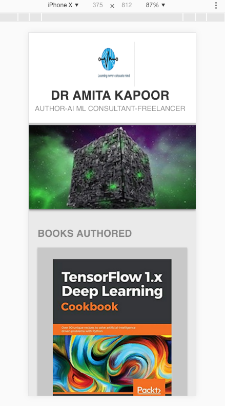

# Udacity Build a Portfolio Site

Front-End Web Developer Nanodegree project.

## File Structure

Files are organized with a directory structure that separates files based on functionality. For example:
* `css/` for stylesheets
* `images/` for images
* `js/` for JavaScript files

## Display
To ensure responsive used Flexbox
And a JavaScript polyfill named [PictureFill](http://scottjehl.github.io/picturefill/)

### On a desktop

### On a tablet

### On a mobile

### Footer
The Footer contains social media links and licensing information.

##### Citations
* The borg cube is from the screenshot of Star Trek Series.
* The logo is self made.
* The images of the books again screenshot from their Ebook version
* The background abstract is taken from pixabay.com 
